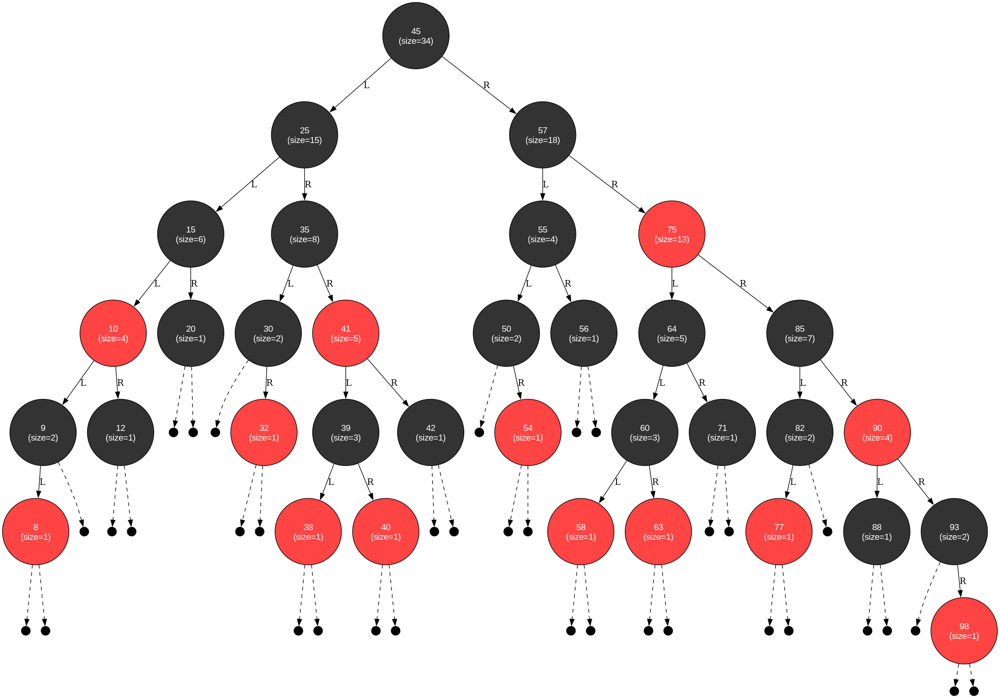

# Red Black Tree



## General Information

### Red-Black Tree Definition

A **Red-Black Tree** is a self-balancing binary search tree that maintains specific properties to ensure efficient operations. It is characterized by the following invariants:

1. **Node Coloring**: Every node is either **red** or **black**
2. **Root Property**: The root node is always **black**
3. **Leaf Property**: All leaves (NIL nodes) are considered **black**
4. **Red Property**: No two consecutive red nodes can appear in any path (a red node cannot have red children)
5. **Black Height Property**: Every path from a given node to any of its descendant NIL nodes must contain the same number of black nodes

### Time Complexity

| Operation | Average Case | Worst Case |
|-----------|--------------|------------|
|  Search   |  O(log n)    |  O(log n)  |
|  Insert   |  O(log n)    |  O(log n)  |
|  Delete   |  O(log n)    |  O(log n)  |
|  Space    |  O(n)        |  O(n)      |

This implementation provides a complete Red-Black Tree with iterator support and range query capabilities.

## How to Install

```bash
git clone https://github.com/daniilgriga/Red_Black_Tree.git
cd Red_Black_Tree/
```

## How to Build

```bash
cmake -S . -B build
cmake --build build
```

## How to Run

### Input Format

The program accepts input data through standard input (`stdin`) in the following format:

### Commands

- **`k <value>`** - insert a key into the tree
  - `value` - integer value (key to insert)
  - Example: `k 10` - inserts the number 10 into the tree

- **`q <low> <high>`** - execute a range query
  - `low` - lower bound of the range
  - `high` - upper bound of the range
  - Example: `q 5 15` - find the number of elements in the range [5, 15]

### Rules

1. **All keys are unique** - duplicate insertion attempts are ignored
2. **Range boundaries**: `low` ≤ `high` (if `low` > `high`, returns 0)
3. **Inclusive range**: `[low, high]` - including boundary values
4. **Command order**: arbitrary, processed sequentially
5. **Unknown commands** are ignored

### Example of Valid Input

```
k 10 k 20 q 8 31 q 6 9 k 30 k 40 q 15 40
```

### Example Output

```
2 0 3
```

### Error Handling

- **Invalid numbers**: ignored
- **Incomplete commands**: ignored
- **Empty input**: allowed (empty output)
- **Only insertions**: allowed (empty output until first query)

## How to test

```bash
cd build
ctest --output-on-failure
```

## Comparison with `std::set`...
